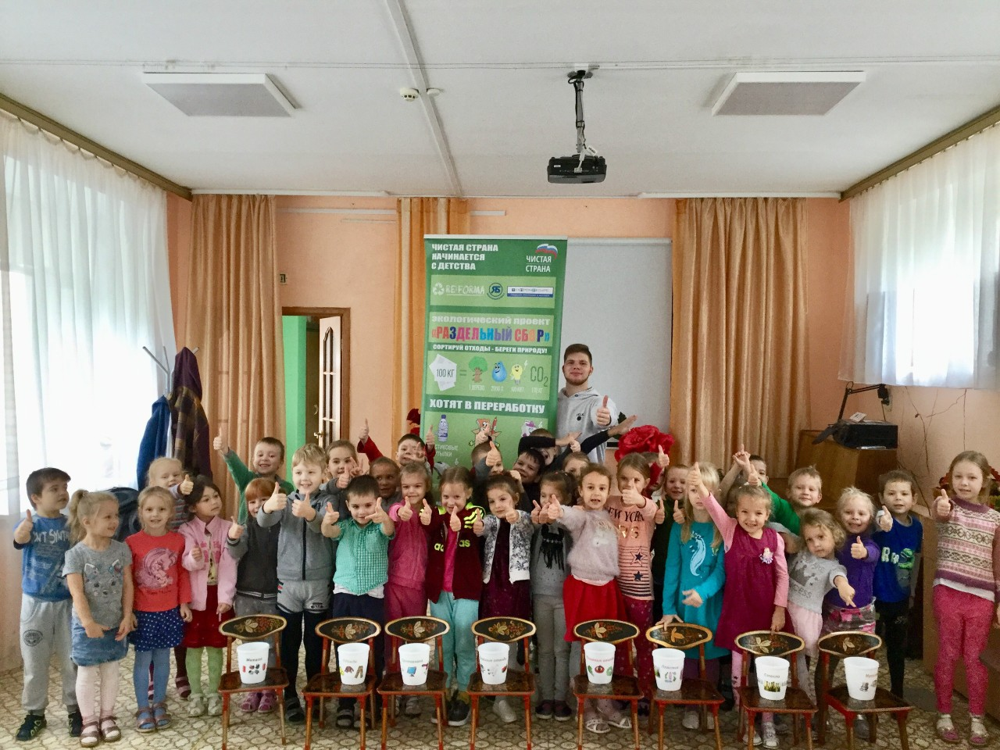
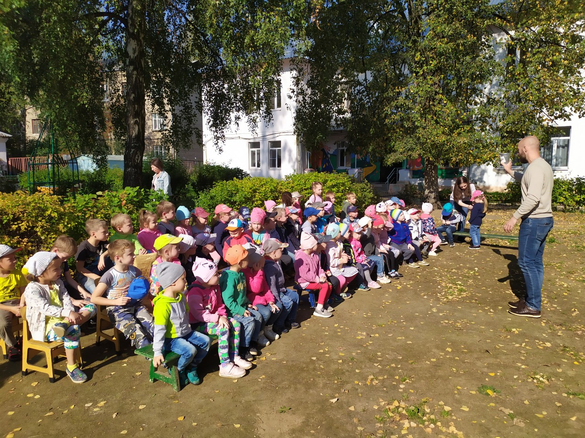

:figure-caption!:
:page-layout: default
:page-title: Детские сады

== Чистая страна начинается с детства

Экологическое просвещение воспитанников детских садов города Ярославля. За 30 минутное занятие дети узнают что такое экология, как они могут сберечь природу, а также в игровой форме научатся сортировать отходы. 

*Проект стартовал в мае 2019 года, в общей сложности проведено более 72 мероприятий для дошкольников.*

.детсад 29

.детсад 246

image::images/детсад-Фомичёв.jpg[,500]

Детские сады получают возможность обменять собранные вторичные ресурсы на подарки от партнёров проекта: саженцы деревьев, альбомы или конструкторы:

.подаренные саженцы туи и спереи
image::images/детсад-саженцы-в-подарок.jpg[,500]

== Партнеры проекта

* Департамент образования города Ярославля
* Департамент охраны окружающей среды и природопользования Ярославской области
* федеральный экологический проект «Чистая страна» политической партии «Единая Россия»
* депутат Ярославской областной Думы Фомичёв Роман Юрьевич 