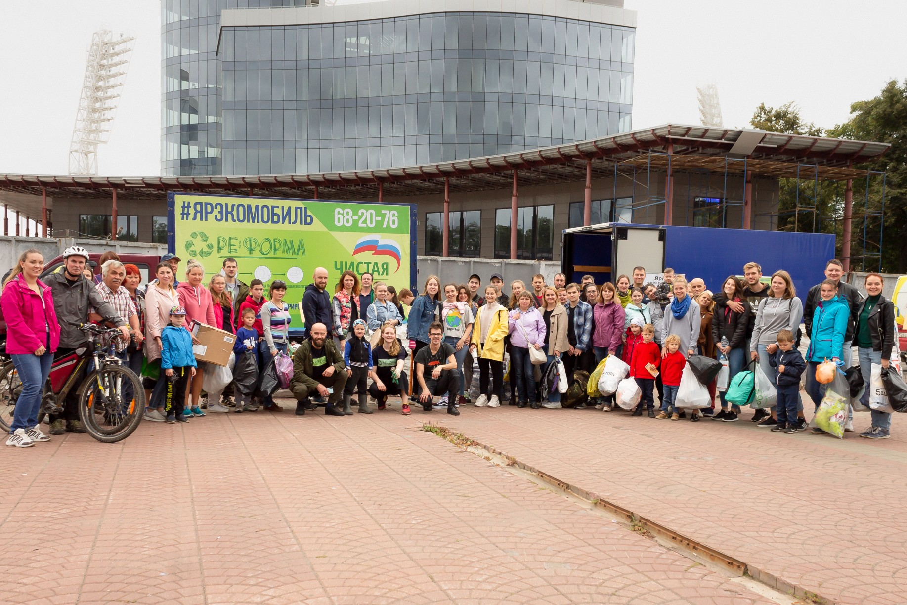

:figure-caption!:
:page-layout: default

Общественная организация *Ре:форма* занимается популяризацией раздельного сбора отходов и экологическим просвещением.

== Данные организации

* Полное название: *Ассоциация по содействию в социально-культурном и экологическом развитии общества "Ре:форма"*
* ОГРН: 1137600000284
* ИНН: 7606081385
* КПП: 760601001
* председатель ассоциации: Козлов Артём Евгеньевич
* дата регистрации: 21 февраля 2013