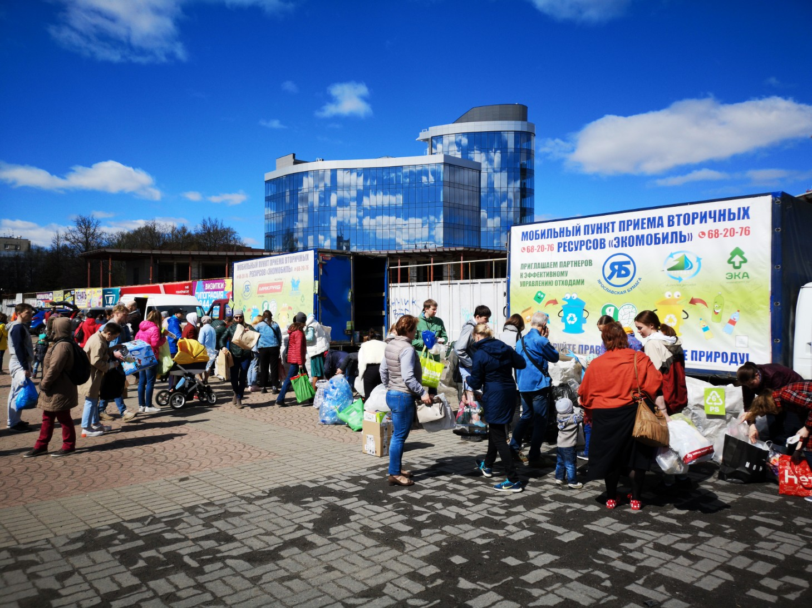
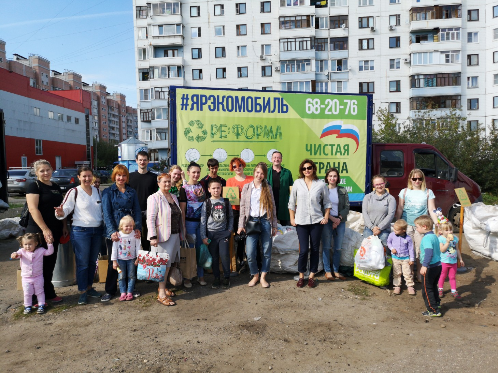

:figure-caption!:
:page-layout: default
:page-title: ЯрЭкомобиль

== ЯрЭкомобиль 

Aкция по сбору вторичных ресурсов от населения: макулатуры, стекла, металлов и пластиков. Проводится в городе Ярославле с 2017 года, а с 2019 также и в Ростове Великом. Проведено более 36 мероприятий.

В *Ярославле* акции проводятся два раза в месяц:
каждое второе воскресенье месяца в Дзержинском районе с 12.00 до 14.00 и
в последнее воскресенье месяца в центре города на пл. Труда с 12.00 до 14.00. 
С сентября 2019 года подключили *Ростов Великий*: каждое третье воскресенье месяца на ул. Октябрьская д.72/25 с 12.00 до 14.00. 

*Количество участников более 1000 человек ежемесячно*.

.ЯрЭкомобиль на площади Труда

С сентября 2019 года благодаря взаимодействию с Департаментом охраны окружающей среды и природопользования Ярославской области, *на акциях осуществляется сбор опасных отходов (батареек, ртутных градусников, различных ламп)*.

.ЯрЭкомобиль в Дзержинском районе

В общей сложности ЯрЭкомобиль собрал и отправил на качественную утилизацию: 18 тонн макулатуры, 25 тонн стекла, 4 тонны ПЭТ-бутылок, 3 тонны ПВД пленки, 3 тонны пластиков с маркировками 2, 4, 5, 6.

.ЯрЭкомобиль в Ростове Великом
image::images/ЯрЭкомобиль-Ростов.jpg[,500]

== Партнеры проекта

* АО «ЯРОСЛАВСКАЯ БУМАГА»
* ООО «ГРИН-ЛЕКТ»
* ООО «ТЕХПРОМРЕУРС»
* ООО «МАКРАБ»
* ИП «Горюнов Д.Ю.»
* ООО «СОДЕЙСТВИЕ»
* ООО "СТРЭНГА"